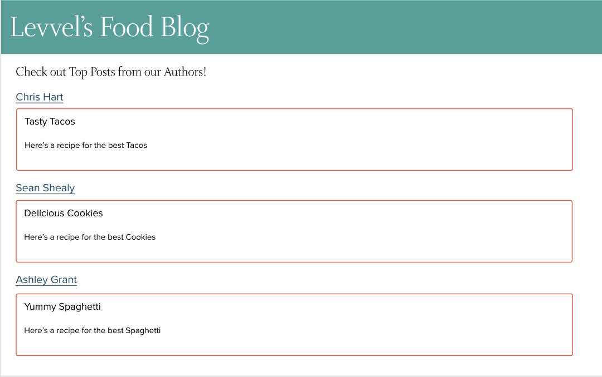
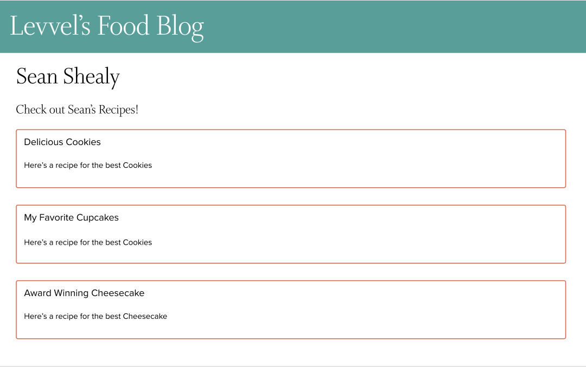

# Endava Technical Interview

## Project Setup
- Fork the repository and clone the repository to your local machine.  Documentation on how to do this https://docs.github.com/en/get-started/quickstart/fork-a-repo
- Open the project locally
- Create a new branch in the newly forked repo using the naming convention **yourFirstName_yourLastName**. This is where your work should be saved.
- To run the project run the following command in the project directory:
`yarn start`
- Open [http://localhost:3000](http://localhost:3000) to view it in the browser.
- To better understand the workflow process, view [this video](https://www.youtube.com/watch?v=1jAtPrOrRPs) on how to fork a repository, and open a pull request to merge branches within a forked repository

## Task
Create a blog website that dynamically renders a list of sample blogs from different authors. The site should include, but is not limited to:
- A home page displaying a selection of blogs from each author. It doesn't matter how you choose which blogs to render from each author. 
- An author page that displays all the blogs for a specific author.

The webpage may be designed any way that you would like. Feel free to modify existing files or create new files. You can add some new dependencies if you choose.

## Data
Please use the [JSON Placeholder API](https://jsonplaceholder.typicode.com/) to load the data for your app. 

## Resources
You may use any internet sources to aid your implementation. [React](https://reactjs.org/docs/getting-started.html) has great documentation if you get stuck/need help.

## Submitting Your Work (IMPORTANT)
When you are finished, create a Pull Request in Github on the forked repository. This Pull Request should compare your created branch to the **main** branch. Email the link to your Pull Request to nicole.niemczycki@endava.com **at least 24 hours before your technical interview**

Again, please make sure your Pull Request is comparing the new branch you created on your forked repo to the *main* branch on your forked repo. The initial repository you forked off of should NOT be referenced.

## Example Interfaces
These are for EXAMPLE purposes only. These images ARE NOT intended to show you what you are supposed to build.
**Please DO NOT HARD CODE YOUR DATA to match these images**. Please pull from the [JSON Placeholder API](https://jsonplaceholder.typicode.com/) for your data as specified in the data section above.

Have fun, and happy coding! :)
